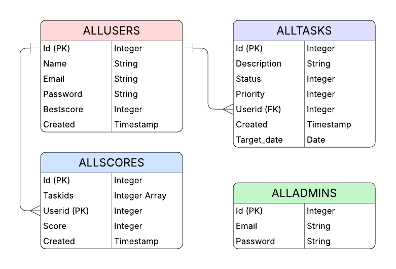

# 🧭 DoneZone – Task Management System

**DoneZone** is a full-stack **Task Management System** built with **React (Frontend)** and **FastAPI (Backend)**.  
It empowers users to create, track, and update daily tasks efficiently — supporting task prioritization, progress tracking, and score analysis for improved productivity.

---

## 🧩 Features

- ✏️ Create, edit, and delete tasks  
- 🚦 Manage task status (`due`, `ongoing`, `completed`)  
- ⚡ Prioritize tasks (`high`, `medium`, `low`)  
- 📊 View daily and weekly performance scores  
- 🔒 Secure JWT authentication  
- 🧑‍💼 Admin-only access for users with `@donezone.com` domain  
- 💻 Responsive and modern UI  

---

## 🛠️ Tech Stack

**Frontend:**  
- React.js (Vite)  
- Axios  
- React Icons  
- CSS  

**Backend:**  
- FastAPI  
- SQLAlchemy ORM  
- PostgreSQL  
- Alembic (for database migrations)  
- JWT Authentication  
- Python 3.10+  

---

## ⚙️ System Requirements

| Component | Version / Requirement |
|------------|------------------------|
| **Python** | ≥ 3.10 |
| **Node.js** | ≥ 18.0 |
| **npm** | ≥ 9.0 |
| **PostgreSQL** | ≥ 14.0 |
| **Alembic** | ≥ 1.13 |
| **FastAPI** | ≥ 0.110 |
| **SQLAlchemy** | ≥ 2.0 |

---

## 🚀 Project Setup

### 🔹 1. Clone the Repository
```bash
git clone https://github.com/ShahrinHossain/Task-Manager.git
cd Task-Manager
```

### 🔹 2. Backend Setup (FastAPI)
```bash
cd backend
python -m venv venv
source venv/bin/activate   # On Windows: venv\Scripts\activate
pip install -r requirements.txt
```

Create a .env file inside backend/ with your configuration:
```bash
DATABASE_URL=postgresql://<username>:<password>@localhost/<database_name>
SECRET_KEY=your_jwt_secret_key
ALGORITHM=HS256
ACCESS_TOKEN_EXPIRE_MINUTES=60
```

Run the backend:
```bash
uvicorn main:app --reload
```

Backend URL:
👉 http://127.0.0.1:8000

### 🔹 3. Database Migration (Alembic)
Initialize Alembic (only once):
```bash
alembic init alembic
```

Every time you change models:
```bash
alembic revision --autogenerate -m "update task model"
alembic upgrade head
```
This ensures your database schema matches the latest code.

### 🔹 4. Frontend Setup (React)
```bash
cd frontend/task-manager-frontend
npm install
npm start
```

Frontend URL:
👉 http://localhost:5173

---


## 🧠 Backend Overview
### 🔹 1. User Management:
- Admin users must register with an email ending in @donezone.com
- Normal users can register with any other domain.
- Passwords are securely hashed and stored in the database.
  
### 🔹 2. Task Lifecycle:
- Tasks are linked to users via foreign keys.
- Each task has a status, priority, and target_date.
- Score calculation is triggered based on completed tasks per day/week.
  
### 🔹 3. Data Flow:
- FastAPI handles business logic and validation.
- SQLAlchemy manages ORM and database relationships.
- Alembic handles schema migrations.

---

## 🧠 API Overview
FastAPI provides an interactive API interface where you can explore and test all endpoints in real time. Once your backend is running, visit:
### 🔹 1. Swagger UI → http://127.0.0.1:8000/docs
### 🔹 2. ReDoc → http://127.0.0.1:8000/redoc

You can use these to test authentication (JWT) and create, update, delete tasks, view response schemas and parameters.

Some examples:
| Endpoint                   | Method | Description                              |
| -------------------------- | ------ | ---------------------------------------- |
| `/register`                | POST   | Register a new user                      |
| `/login`                   | POST   | Authenticate and return JWT              |
| `/create_task`             | POST   | Create a new task                        |
| `/update_task/{id}`        | PUT    | Update task details                      |
| `/update_task_status/{id}` | PATCH  | Update only task status                  |
| `/delete_task/{id}`        | DELETE | Delete a task                            |
| `/score`                   | GET    | Get today’s, weekly, and previous scores |

Example /score Response:
```bash
{
  "today_score": 40,
  "this_week_scores": [
    {"date": "2025-10-13", "score": 40}
  ],
  "previous_weeks": [
    {"week_start": "2025-10-06", "week_end": "2025-10-12", "score": 0}
  ]
}
```
---
## 🧩 Entity Relationship Diagram (ERD)
Below is the Entity–Relationship Diagram (ERD) representing the database structure.




---
## 🎨 UI Highlights
- Light pink and brown dashboard
- Interactive dropdowns for status and priority
- Responsive layout for desktop and mobile
- Smooth transitions between editing and deleting modes

---
##  📂 Folder Structure
```bash
Task-Manager/
|
├── backend/
│ ├── alembic/                  # Alembic migration files
│ ├── app/                      # Core application package
│ │ ├── routes/                 # API route definitions
│ │ │ ├── admin_routes.py
│ │ │ ├── auth_routes.py
│ │ │ └── routes.py
│ │ ├── admin_utils.py          # Utility functions for admin features
│ │ ├── auth_utils.py           # Authentication & JWT helpers
│ │ ├── database.py             # Database connection & session management
│ │ ├── main.py                 # FastAPI entry point
│ │ ├── models.py               # SQLAlchemy ORM models
│ │ └── utils.py                # General-purpose utility functions
│ ├── .env                      # Environment variables (DB URL, JWT secret, etc.)
│ ├── alembic.ini               # Alembic configuration file
│ ├── requirements.txt          # Python dependencies
│ └── venv/                     # Virtual environment (optional)
│
├── frontend/
│ └── task-manager-frontend/
│   ├── public/                 # Static files like favicon and index.html assets
│   ├── src/                    # Main React source directory
│   │ ├── components/           # Reusable UI components (buttons, modals, etc.)
│   │ ├── config/               # Global configuration (e.g., BASE_URL, constants)
│   │ ├── assets/               # Images, icons, and visual assets
│   │ ├── pages/                # Page-level components (Dashboard, Login, etc.)
│   │ ├── .jsx and .css files   # Core UI and styling logic for each page/component
│   │
│   ├── index.html              # Root HTML entry point for the React app
│   ├── .env                    # Frontend environment variables (API base URL, etc.)
│   └── package.json            # Frontend dependencies and scripts
│
├── .gitignore                  # Ignored files and directories for Git
└── README.md                   # Project documentation
```

---
## 🧑‍💻 Author
📍 Bangladesh
💡 Computer Science and Engineering Student
✨ Passionate about full-stack development & clean UI design

---
## 🏁 License
This project is licensed under the MIT License — feel free to use, modify, and distribute.

---
## 🌟 Show Your Support
If you like DoneZone, please ⭐ the repository and share your feedback!

Happy coding !

